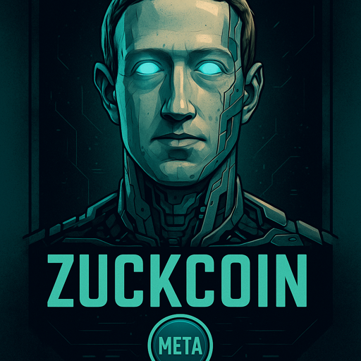

# 🧠 ZuckCoin ($META)

> *The first memecoin that watches you back.*

ZuckCoin ($META) è una memecoin nata dal culto distopico del Metaverso e dell’onnipresente Mark Zuckerberg.  
Unisce meme, ironia tech e uno spirito cyber-satirico per diventare la nuova sensazione virale nel mondo cripto.

---

## 📜 Tokenomics

- **Supply:** 69,000,000,000 $META
- **Blockchain:** Base (L2 Ethereum)
- **Tax:** 1% Burn su ogni transazione (deflazionaria)
- **Standard:** ERC-20 compatibile

| Allocazione | Percentuale |
|-------------|-------------|
| Liquidity Pool | 40% |
| Burn iniziale | 30% |
| Community / Airdrop | 20% |
| Dev wallet | 10% (vested) |

---

## 🌐 Sito Web

Hostato su GitHub Pages:  
➡️ [https://tuonomeutente.github.io/zuckcoin](https://tuonomeutente.github.io/zuckcoin)

---

## 🚀 Come acquistare

1. Aggiungi rete **Base** su MetaMask: [chainlist.org](https://chainlist.org/)
2. Aggiungi token personalizzato: `$META` (indirizzo contratto)
3. Acquista tramite BaseSwap o Uniswap (su Base)

---

## 👁️ Meme virali (pronti all’uso)

- “He knows when you’re sleeping. He knows when you bought Pepe. He is $META.”
- “This isn’t financial advice. This is an algorithmic suggestion.”
- “Buying $META is like accepting cookies. You didn’t read it. You just clicked yes.”

---

## 📱 Social & Contatti

- Twitter/X: [@ZuckCoinMeta](https://x.com/ZuckCoinMeta)
- Telegram: [t.me/ZuckCoinPortal](https://t.me/ZuckCoinPortal)
- GitHub Repo: [github.com/tuonomeutente/zuckcoin](https://github.com/tuonomeutente/zuckcoin)

---

## 🤖 Autorizzazioni

Questo è un progetto satirico. Mark Zuckerberg non è affiliato (speriamo).  
Tutti i loghi sono meme. Tutti i meme sono legge.

